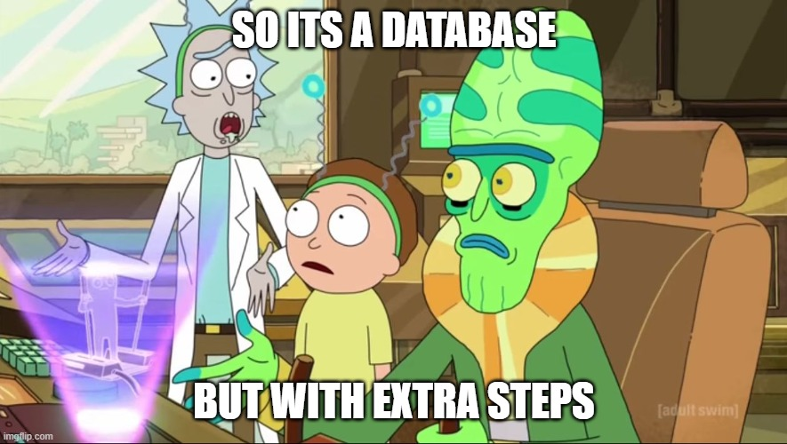

Title: Building a Vector Database: My Journey from Scratch 🚀
Date: 2025-03-16
Category: General
Tags: database, develop, journey
Slug: scratch
Author: Nishanth Ravindran
---
# Building a Vector Database: My Journey from Scratch 🚀

## From Application Developer to Database Builder

For over a decade, I've been immersed in application development, often relying on others for the underlying infrastructure.  I've navigated countless system design and data structure interviews, always harboring a secret desire: to build something fundamental from the ground up.  This project is my chance to finally put that knowledge into action!

## Diving into the World of Vector Databases

This is where I channel my creative energy – into building a functional vector database.  My fascination began with a quirky experiment using `sqlite` (more of a hack than a true database!), but this time it's different.  The goal: to create a system that seamlessly handles diverse text data and stores it as vector embeddings.

## What's a Vector Database, Anyway?

Let's get the basics straight. According to Google Gemini:

> "A vector database is a database specifically designed to store, manage, and query vector embeddings for similarity search and retrieval."

In simpler terms, it excels at:

* **Storing and managing large arrays of floating-point values (vectors).**
* **Performing efficient similarity searches – finding data points that are "close" to a given query.**

## Database Fundamentals: Keeping it Simple

Building a database from scratch is a formidable challenge. It demands performance, reliability, security, and scalability.  At its core, a database needs to:

1.  **Be fast.**
2.  **Offer a simple data storage interface.**
3.  **Ensure reliable and repeatable operations.**
4.  **Scale effectively.**

These requirements often clash, hinting at the complexities of the CAP theorem.  However, with smart design choices, we can achieve a balance.

### **Speeding Things Up: B-Tree Indexing**

Imagine a library with an incredibly detailed card catalog. That's the essence of a B-tree index! Gemini explains it best:

> "Imagine a library with a super organized card catalog, but instead of just author or title, it's for every single word in every book! That's kinda like a B-tree index. Think of it as a multi-level directory. At the top, you have broad categories, like "A-M" and "N-Z". Each of those points to more specific sub-categories, like "Apple to Bat" and "Bear to Cat". Eventually, you hit the "leaf" level, which tells you exactly where in the book (or database) that word (or piece of data) is located.
>
> So, when you search for "banana", the database doesn't have to read every single book. It quickly hops from "A-M" to "Bear to Cat", and then directly to the page where "banana" is hiding. It's like a super-fast treasure map for your data, keeping everything sorted and easily accessible, making lookups incredibly efficient."

Essentially, B-trees drastically reduce search times for large datasets.

### **Caching: Keeping Hot Data Close**

Caching involves storing frequently accessed data in RAM for faster retrieval.  But it raises questions:

* How often should caches be updated?
* How do we handle cache replication?

🤔🤔🤔 These are challenges we'll tackle later!

### **Scaling with Sharding**

Sharding breaks down large datasets into smaller chunks, distributed across multiple servers.  While it might seem counterintuitive (trading disk reads for network calls), it's essential for scaling beyond the limits of a single server.  This ensures the database can handle increasing loads effectively.